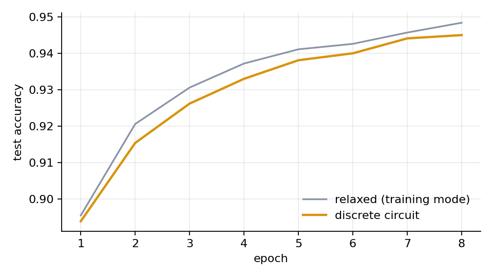
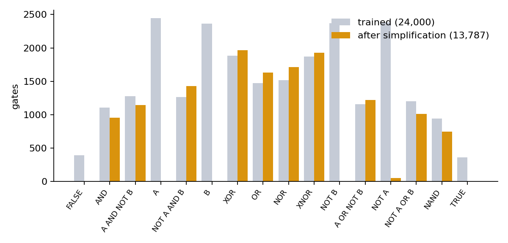

# Logic gate networks

[](https://georgepol1023.github.io/logic-gate-nets/)

Neural networks where every neuron is a two-input logic gate. They're trained with
gradient descent like any other network, but the finished model is a plain boolean
circuit: no weights, no multiplications, just AND, OR, XOR and friends. That circuit
can be simplified with classic logic-synthesis passes and compiled to bitwise C++.
Because it is only gates, it is also a natural candidate for hardware such as FPGAs,
though that isn't tested here.

The method comes from Petersen et al., [*Deep Differentiable Logic Gate Networks*](https://arxiv.org/abs/2210.08277)
(NeurIPS 2022). This repo is my own implementation of the training, plus the parts
around it: circuit simplification, C++ code generation, a browser demo, and a set of
experiments on accuracy, circuit size and speed.

**[Try the demo: draw a digit and watch 13,787 gates vote on it](https://georgepol1023.github.io/logic-gate-nets/)**

## How it works

**Gates as neurons.** Each gate reads two inputs, chosen at random when the network
is built and never changed. What the gate learns is *which* of the 16 possible
two-input boolean functions to compute.

**Training soft.** Boolean functions have no useful gradients, so during training
each gate outputs a softmax-weighted mix of all 16, using a real-valued version of
each one (for example AND becomes `a·b` and XOR becomes `a + b − 2ab`). Every one of
these relaxations has the form `c0 + c1·a + c2·b + c3·a·b`, so instead of evaluating
16 functions per gate, a layer multiplies its softmax by a fixed 16×4 table and
evaluates one expression with four coefficients. Same result, a fraction of the
memory.

**Freezing hard.** After training, each gate keeps only its most likely function and
the network becomes an exact boolean circuit. The gap between the soft and hard
accuracy is something to watch: the curves below show it stays small.

**Classifying.** The last layer is split into one group per class. Each class's
score is simply the number of gates in its group that output 1.

**Simplifying.** A trained network is full of gates that do nothing useful. Before
export, `lgn/circuit.py` runs constant propagation, collapses wires and double
negations, folds NOTs into neighbouring gates (`AND(NOT x, y)` becomes one gate),
merges identical gates, and removes anything that can't reach an output. Every
export is checked against the network to confirm the two give identical outputs.

## Results

| Model | Size | After simplifying | Depth | Test accuracy |
|---|---|---|---|---|
| sklearn digits, 8×8 | 8,000 gates | 3,935 gates | 4 | 96.9% |
| sklearn digits, pass-through init | 8,000 gates | 1,812 gates | 4 | 95.6% |
| MNIST, 8 epochs | 24,000 gates | 13,787 gates | 4 | 94.5% |
| MNIST float MLP (baseline) | 269,322 params | n/a | n/a | 97.7% |

Both models see exactly the same binarized pixels. On MNIST the circuit is 3.2 points
behind a float MLP while using no arithmetic at all. Its accuracy was still rising
when training stopped after 8 epochs (see the curve below); how much a longer run
would gain hasn't been measured yet.

Simplification removed 43% of the MNIST gates. The simplified circuit was checked
against the trained network on all 10,000 test images and gave identical outputs.



**Initialization changes the circuit, not just the accuracy.** Initializing every
gate close to a pass-through wire (the "residual" init from the follow-up paper)
gave a circuit 2.2× smaller on digits for 1.3 points less accuracy (one run of each,
seed 0, so treat the exact numbers as indicative). Most gates
simply never moved away from being wires, and the simplifier deletes wires for free.
That makes the init a knob for trading accuracy against hardware cost.

**Which gates does it pick?** After simplification, XOR and XNOR are the most common
gates in the MNIST circuit (1,963 and 1,926), with NOT almost absent (50), because
negations get absorbed into the gates around them.



## Speed

All numbers are per image on the 10,000 MNIST test images, using one CPU core of a cloud VM.
The generated-code rows were measured with an earlier version of the code generator that
produced C; the current C++ generator hasn't been re-benchmarked on that machine yet.
Each generated-code run is checked to give exactly the same vote counts as NumPy.

| Implementation | Time per image |
|---|---|
| Generated C (earlier version), circuit only | 233 ns |
| Generated C (earlier version), circuit + vote counting | 3,550 ns |
| NumPy, bit-sliced | 1,215 ns |
| Float MLP baseline, NumPy matmuls | 7,252 ns |
| PyTorch, network in eval mode | 1,060,000 ns |

The fast versions are **bit-sliced**: each 64-bit word holds the same input bit for
64 different images, so a single CPU instruction evaluates one gate for 64 images at
once.

**End to end, the circuit is about 2× faster than the float MLP** (3,550 ns against
7,252 ns). The circuit alone takes 233 ns, but counting each class's votes, done
naively one image at a time, takes about 15× longer than the circuit itself. The fix
is to count bit-sliced too, with a tree of adders built from gates, which would make
the classifier circuit-only from input to answer. That's next on the list.

The comparison isn't perfectly like for like: the circuit runs as generated code,
while the MLP runs as NumPy matrix multiplies (optimised BLAS), not generated code.

PyTorch is slow here because it simulates the circuit with float tensors. It's there
to check correctness, not as a serious competitor.

## Learning an adder from its truth table

`adder.py` gives a 131-gate network the 16 rows of a 2-bit adder's truth table and
asks it to find a circuit. 10 out of 18 random starts found one that is exactly
correct on every row. After simplification these range from 11 to 32 gates; a
textbook ripple-carry adder needs 7.

The smallest one is small enough to read:

```
g0  = NAND(A1, B0)          g6  = XOR(g1, g3)
g1  = XNOR(A1, B1)          g7  = A_OR_NOT_B(B1, g0)
g2  = OR(A1, A0)            g8  = NOT_A_OR_B(g4, g5)
g3  = NAND(A0, B0)          g9  = NAND(g2, g7)
g4  = XOR(A0, B0)           g10 = A_AND_NOT_B(g8, g9)
g5  = AND(A1, g1)

S0 = g4    S1 = g6    S2 = g10
```

The sum bits are the textbook solution: S0 is `A0 ⊕ B0`, and S1 is
`(A1 XNOR B1) XOR NAND(A0, B0)`, which works out to `A1 ⊕ B1 ⊕ A0·B0`, the sum bit
plus carry. The carry-out bit is correct but takes a much less direct route than a
human would. The script also writes the circuit in the format of my
[Logic Circuit Builder](https://github.com/georgepol1023/Logic-Gates).

## Running it

```bash
pip install -r requirements.txt

python train.py --dataset digits                       # about 2 minutes on a CPU
python train.py --dataset digits --init residual --name digits_residual
python train.py --dataset mnist --layers 4 --width 6000 --tau 15 --epochs 8 --name mnist_l4_w6000
python baseline_mlp.py --dataset mnist --epochs 10
python benchmark.py runs/mnist_l4_w6000 --mlp runs/mlp_mnist   # needs g++ for the C++ path
python adder.py --bits 2
python plot.py runs/mnist_l4_w6000
python export_demo.py runs/mnist_l4_w6000              # writes docs/model.js
pytest
```

MNIST downloads automatically on first use. The demo is a static page in `docs/`:
open `docs/index.html` directly, or serve the folder with GitHub Pages.

## Layout

```
lgn/
  ops.py        the 16 gates and their real-valued relaxations
  layers.py     LogicLayer (random wiring, learned gate choice) and GroupSum
  model.py      LogicNet
  circuit.py    netlist extraction, simplification, bit-sliced evaluation
  codegen.py    netlist to C++
  export.py     exports for the web demo and the Logic Circuit Builder
  data.py       digits / MNIST loading and thermometer encoding
train.py, baseline_mlp.py, benchmark.py, adder.py, plot.py, export_demo.py
docs/           browser demo and figures
tests/
```

## Limitations and next steps

- The wiring is random and fixed; only the gate choice is learned. Learning the
  connections too, or using structured (convolution-like) wiring, is the obvious
  next step and is what the follow-up work does.
- Vote counting is the speed bottleneck (see above). A bit-sliced popcount circuit
  would fix it.
- The speed numbers are for a CPU. An FPGA is the natural target for this kind of
  model, since each gate maps onto lookup-table logic, but no FPGA version has been
  built or measured yet.
- Training is much slower than for the MLP baseline (about 20 minutes against
  26 seconds on MNIST): the gates are cheap at inference but each needs 16 logits
  during training.

## Reference

Petersen, F., Borgelt, C., Kuehne, H., Deussen, O. *Deep Differentiable Logic Gate
Networks.* NeurIPS 2022.
